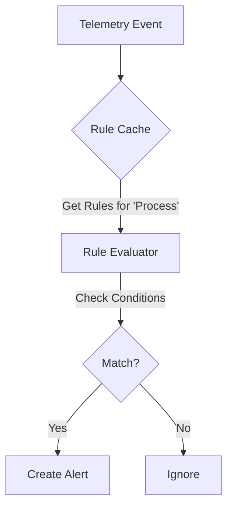

# The Rule-Based Detection Engine: A Deep Dive
**Architecture, Logic, and Implementation Guide**

---

# Part 1: The Concept (What is it?)

## 1. Rule-Based Detection
At its core, a detection engine is a system that asks **"Does this event match a known bad pattern?"**

*   **The Input:** A stream of events (logs, telemetry).
*   **The Logic:** A set of "If-Then" rules.
*   **The Output:** An Alert.

**Analogy:**
Think of it like a **Spam Filter**.
*   *Input:* Incoming Email.
*   *Rule:* If Subject contains "Win $1,000,000" AND Sender is "Unknown".
*   *Output:* Move to Spam Folder.

## 2. Why Rule-Based?
*   **Determinism:** You know exactly *why* an alert fired.
*   **Speed:** Simple string/number comparisons are microsecond-fast.
*   **IOCs (Indicators of Compromise):** Security teams share lists of "bad IPs" or "bad file hashes". Rules are the perfect way to implement these.

---

# Part 2: The Data Structures (The "Nouns")

To build an engine, you need three core objects.

## 1. The Event (Telemetry)
The raw data coming from the endpoint.

**Generic Structure:**
```json
{
  "timestamp": "2023-10-27T10:00:00Z",
  "type": "process",
  "data": { "command": "powershell.exe -enc..." }
}
```

### **Case Study: EDR `TelemetryEvent`**
Defined in `models.py`. We store it in MongoDB.
*   `event_id`: Unique ID.
*   `agent_id`: Who sent it.
*   `raw_data`: The full JSON payload.

## 2. The Rule (Detection Logic)
The definition of "bad".

**Generic Structure:**
```json
{
  "id": "RULE-001",
  "conditions": [
    { "field": "process.name", "operator": "equals", "value": "powershell.exe" },
    { "field": "process.command_line", "operator": "contains", "value": "-enc" }
  ],
  "logic": "AND"
}
```

### **Case Study: EDR `DetectionRule`**
Defined in `detection_models.py`.
*   `detection_logic`: Stores the JSON conditions above.
*   `mitre_techniques`: Maps to the MITRE ATT&CK framework (e.g., T1059).
*   `exceptions`: A list of "Allow-lists" to prevent false positives.

## 3. The Alert (The Result)
What happens when a Rule matches an Event.

### **Case Study: EDR `Alert`**
Defined in `detection_models.py`.
*   `rule_id`: Which rule matched.
*   `endpoint_id`: Where it happened.
*   `evidence_summary`: A snapshot of *why* it matched (e.g., the specific command line).

---

# Part 3: The Engine (The "Verbs")

This is the code that runs inside your **Celery Worker**.

## 1. The Architecture


## 2. Implementation Breakdown (`rule_engine.py`)

### **A. Caching (`RuleCache`)**
**Problem:** Fetching 500 rules from MongoDB for *every* event is too slow.
**Solution:** Load rules into RAM and keep them there for 5 minutes.

```python
class RuleCache:
    _rules_cache = None  # Stores rules in memory
    
    @classmethod
    def get_rules(cls, entity_type):
        if cls._cache_expired():
            cls._load_rules() # Fetch from DB only if expired
        return cls._rules_cache.get(entity_type, [])
```

### **B. Evaluation (`ConditionEvaluator`)**
**Problem:** How do we compare `process.command_line` (Event) with `"-enc"` (Rule)?
**Solution:** A generic evaluator that handles operators like `equals`, `contains`, `regex`.

```python
class ConditionEvaluator:
    @staticmethod
    def evaluate(event, condition):
        # 1. Extract value from Event (e.g., "powershell.exe -enc...")
        actual_value = _extract_field(event, condition['field'])
        
        # 2. Compare using Operator
        if condition['operator'] == 'contains':
            return condition['value'] in actual_value
        # ... handle other operators ...
```

### **C. Orchestration (`DetectionEngine`)**
**Problem:** Tie it all together.
**Solution:** The main entry point called by Celery.

```python
class DetectionEngine:
    @staticmethod
    def evaluate_event(event_id):
        # 1. Get Event
        event = TelemetryEvent.objects.get(id=event_id)
        
        # 2. Get Rules (from Cache)
        rules = RuleCache.get_rules(event.event_type)
        
        # 3. Check each rule
        for rule in rules:
            if RuleEvaluator(rule, event).evaluate():
                _create_alert(rule, event)
```

---

# Part 4: Operations (Creating Rules)

## 1. Anatomy of a Rule
To create a new detection, you insert a JSON document into MongoDB.

**Example: Detect "Whoami" Execution**
```json
{
  "rule_id": "RULE-TEST-001",
  "name": "Suspicious Discovery Command",
  "severity": "LOW",
  "enabled": true,
  "detection_logic": {
    "entity_type": "process",
    "logic": "OR",
    "conditions": [
      {
        "field": "process.name",
        "operator": "equals",
        "value": "whoami.exe"
      },
      {
        "field": "process.command_line",
        "operator": "contains",
        "value": "net user"
      }
    ]
  }
}
```

## 2. Testing
1.  **Create Rule:** Add the JSON above to the DB.
2.  **Send Event:** Use `curl` to send a telemetry event with `whoami.exe`.
3.  **Verify:** Check the `alerts` collection in MongoDB.

---

# Part 5: Optimization & Best Practices

## 1. Pre-Filtering (The "Fast Path")
**Concept:** Don't run a "Network" rule against a "File" event.
**Implementation:** `RuleCache` organizes rules by `entity_type`. We only fetch relevant rules.

## 2. Field Extraction
**Concept:** Accessing nested JSON (`process.parent.name`) is complex.
**Implementation:** We use a helper `_extract_field` that splits the string by dots (`.`) and traverses the dictionary.

## 3. Exception Handling (False Positives)
**Concept:** `whoami.exe` is bad... unless it's run by the Admin.
**Implementation:** Every rule has an `exceptions` list. If *any* exception matches, the Alert is suppressed.

```python
def evaluate(self):
    if self._check_exceptions():
        return False # False Positive, don't alert
    # ... continue evaluation ...
```

---

**Summary:**
Your Detection Engine is a **high-performance, in-memory evaluation system**. It uses **Caching** to stay fast, **Generic Operators** to be flexible, and **Exception Logic** to reduce noise. It is the brain of your EDR.
