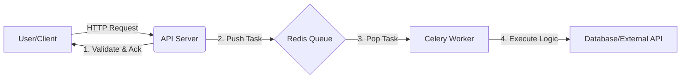

# Redis, Celery, and Docker: A Modern Architecture Guide
**From Concept to Implementation (With EDR Case Study)**

---

# Part 1: The Foundation (Concepts & Architecture)

## 1. The Core Concepts (Universal)

Every modern backend system needs to handle tasks that are too slow for a standard HTTP request. Here are the three pillars that solve this:

| Component | The Analogy | The Universal Role |
| :--- | :--- | :--- |
| **Docker** | The Shipping Container | **Standardization:** Packages code, OS, and libraries so it runs identically on any machine (Dev, QA, Prod). |
| **Redis** | The Sticky Note / Rail | **Message Broker:** A super-fast, in-memory storage that holds "To-Do" tickets for background workers. |
| **Celery** | The Chef / Worker | **Task Queue:** A distributed worker system that picks up tickets from Redis and executes them asynchronously. |

## 2. The Architecture (Data Flow)

In any distributed system, the flow looks like this:



### **Case Study: Our EDR Implementation**
In our specific **Endpoint Detection & Response (EDR)** project, this architecture solves a critical bottleneck:

*   **The Client:** An EDR Agent running on a user's laptop.
*   **The Request:** Sending a telemetry log (e.g., "PowerShell executed `malware.ps1`").
*   **The Bottleneck:** Running 100+ detection rules takes **500ms**. If the API waits for this, it freezes.
*   **The Fix:**
    1.  **Django API** accepts the log in **5ms**.
    2.  **Redis** holds the "Analyze this log" ticket.
    3.  **Celery** runs the heavy detection rules in the background.

---

# Part 2: The Implementation (The "How")

## 3. Directory Structure (Standard Pattern)

This is the industry-standard layout for a Django + Celery project:

```text
project_root/
├── docker-compose.yml           # Orchestrator
├── backend/
│   ├── project_name/            # Main Config Folder
│   │   ├── celery.py            # Entry Point
│   │   ├── settings.py          # Configuration
│   ├── app_name/                # Feature App
│   │   ├── tasks.py             # Background Logic
│   │   ├── views.py             # Trigger
```

## 4. Code Setup (Generic vs. EDR)

### **A. The Entry Point (`celery.py`)**
**Goal:** Initialize Celery and link it to Django.

```python
import os
from celery import Celery

# 1. Link to Django Settings
os.environ.setdefault('DJANGO_SETTINGS_MODULE', 'project_name.settings') # Generic
# os.environ.setdefault('DJANGO_SETTINGS_MODULE', 'edr_server.settings') # Our EDR

app = Celery('project_name')

# 2. Load Config (Look for CELERY_ variables)
app.config_from_object('django.conf:settings', namespace='CELERY')

# 3. Auto-find tasks
app.autodiscover_tasks()
```

### **B. The Configuration (`settings.py`)**
**Goal:** Tell Celery where the Broker (Redis) is.

```python
import os

# 1. Dynamic Host (Docker vs Local)
# Best Practice: Use Env Vars with a 'localhost' default for dev.
REDIS_HOST = os.getenv('REDIS_HOST', 'localhost')
REDIS_PORT = os.getenv('REDIS_PORT', '6379')

# 2. Broker URL
CELERY_BROKER_URL = f'redis://{REDIS_HOST}:{REDIS_PORT}/0'

# 3. Result Backend
CELERY_RESULT_BACKEND = f'redis://{REDIS_HOST}:{REDIS_PORT}/0'

# 4. Windows Compatibility (Dev Only)
CELERY_WORKER_POOL = 'solo' 
```

### **C. The Logic (`tasks.py`)**
**Goal:** Define the background job.

**Generic Pattern:**
```python
@shared_task
def send_email(user_id):
    user = User.objects.get(id=user_id)
    email.send(...)
```

**Our EDR Implementation:**
```python
@shared_task(bind=True)
def telemetry_ingest(self, data):
    # 1. Save Event (I/O Bound)
    event = TelemetryEvent(raw_data=data).save()
    
    # 2. Run Detection (CPU Bound)
    DetectionEngine.evaluate_event(event.event_id)
```

### **D. The Trigger (`views.py`)**
**Goal:** Offload the work from the API.

**Generic Pattern:**
```python
def signup_view(request):
    # ... create user ...
    send_email.delay(user.id) # Returns immediately
    return Response("User Created")
```

**Our EDR Implementation:**
```python
def telemetry_endpoint(request):
    telemetry_ingest.delay(request.data) # Returns immediately
    return Response({"status": "queued"})
```

---

# Part 3: Operations (Running & Verifying)

## 5. Running with Docker (Production Standard)

**Universal `docker-compose.yml` Pattern:**

```yaml
services:
  redis:
    image: redis:7-alpine
    container_name: my-redis
    
  backend:
    depends_on: [redis]
    environment:
      - REDIS_HOST=redis
      
  celery:
    depends_on: [redis, backend]
    environment:
      - REDIS_HOST=redis
    command: celery -A project_name worker -l info
```

## 6. Running Manually (Local Dev)

If you aren't using Docker, you need **3 Terminals**:

1.  **Broker:** `redis-server` (WSL/Memurai on Windows, Native on Linux).
2.  **API:** `python manage.py runserver`
3.  **Worker:** `celery -A project_name worker -l info` (Add `--pool=solo` on Windows).

## 7. Verification (Smoke Test)

**Universal Test:**
1.  Trigger the task via API/Curl.
2.  Check Redis Queue: `redis-cli LLEN celery` (Should go 0 -> 1 -> 0).
3.  Check Worker Logs: Look for "Task received" and "Task succeeded".

---

# Part 4: Advanced Engineering

## 8. Extending the System

To add **ANY** new background feature (Email, Reports, Cleanup):
1.  **Define:** Create a function in `tasks.py` with `@shared_task`.
2.  **Call:** Use `.delay()` in your view or logic.
3.  **Restart:** Restart the Celery worker to load the new code.

## 9. Deep Dive: Pools & URLs

### **Worker Pools (`--pool`)**
*   **`prefork` (Linux/Prod):** The standard. Uses `fork()` to create parallel processes.
*   **`solo` (Windows/Dev):** The workaround. Runs in a single thread because Windows lacks `fork()`.

### **Redis URLs**
`redis://[host]:[port]/[db]`
*   **Docker:** `redis://redis:6379/0` (Host = Service Name)
*   **Local:** `redis://localhost:6379/0` (Host = Localhost)

## 10. Best Practices Checklist

*   [ ] **Pass IDs, Not Objects:** Data changes; IDs don't.
*   [ ] **Idempotency:** Tasks should be safe to run twice.
*   [ ] **Retries:** Handle network blips automatically.
*   [ ] **Monitoring:** Use tools like **Flower** to visualize the queue.

---

**Summary:**
This architecture decouples "Receiving Work" (API) from "Doing Work" (Celery). While we use it for **EDR Telemetry Analysis**, the exact same setup is used by Instagram (Notifications), Uber (Trip Calculations), and Netflix (Video Encoding).
