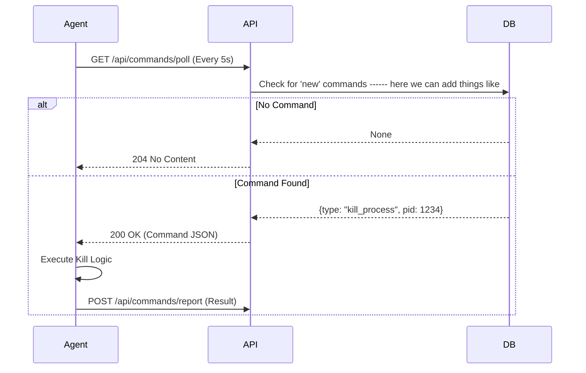

# Response Actions & Event Conversion: The Full Lifecycle
**From Raw Sysmon Logs to Remote Remediation**

---

# Part 1: Event Conversion (The "Translator")

Before we can detect threats, we must translate Windows language (Sysmon) into our language (JSON). This happens in the C++ Agent.

## 1. The Source: Sysmon
Windows generates complex XML/JSON logs.
*   **Event ID 1:** Process Creation
*   **Event ID 3:** Network Connection

## 2. The Converter (`EventConverter.cpp`)
This C++ class is the bridge.

### **Step A: Mapping IDs**
It translates numbers to human-readable types.
```cpp
std::string EventConverter::mapSysmonToEventType(int eventId) {
    switch (eventId) {
        case 1:  return "process";
        case 3:  return "network";
        case 11: return "file";
        default: return "unknown";
    }
}
```

### **Step B: Normalization (`sysmonEventToDjangoFormat`)**
It takes the messy Sysmon JSON and builds a clean, standardized JSON object.

**Key Logic:**
1.  **Extracts Info:** Pulls `Image`, `CommandLine`, `ProcessId` from the nested `EventData`.
2.  **Generates Metadata:** Adds `agent_id` (Hostname) and a unique `event_id`.
3.  **Formats Timestamp:** Converts Windows SystemTime to a standard Unix timestamp.

**Code Snippet:**
```cpp
djangoEvent["process"] = {
    {"name", eventData.value("Image", "")},
    {"pid", eventData.value("ProcessId", 0)},
    {"command_line", eventData.value("CommandLine", "")},
    {"action", "created"}
};
```

**Result:** A clean JSON payload sent to the Django API.

---

# Part 2: The Command Loop (The "Remote Control")

How do we tell an agent to "Kill Process 1234"? We can't push to it (firewalls block us). So, the agent **polls** us.

## 1. The Architecture (HTTP Polling)



---

# Part 3: Backend Implementation (The "Brain")

This logic lives in `backend/ingestion/command_views.py`.

## 1. Creating a Command (The Trigger)
When an analyst clicks "Kill Process" in the dashboard:

1.  **API Endpoint:** `trigger_kill_process`
2.  **Action:** Creates a `PendingCommand` document in MongoDB.
3.  **Status:** Sets status to `new`.
4.  **Audit:** Creates a `ResponseAction` log (Who did it? Why?).

```python
command = PendingCommand(
    agent_id=agent_id,
    command_type='kill_process',
    parameters={'pid': 1234},
    status='new',  # Waiting for agent
    issued_by=user.email
)
command.save()
```

## 2. Delivering the Command (The Poll)
When the agent asks "Anything for me?":

1.  **API Endpoint:** `poll_commands`
2.  **Logic:** Finds the oldest `new` command for that Agent ID.
3.  **Update:** Marks command as `in_progress` so it's not sent twice.

```python
def poll_commands(request):
    agent_id = request.headers.get('X-Agent-ID')
    command = PendingCommand.objects(agent_id=agent_id, status='new').first()
    
    if command:
        command.status = 'in_progress'
        command.save()
        return Response(command.data)
```

## 3. Processing the Result (The Report)
When the agent says "I did it!":

1.  **API Endpoint:** `report_command_result`
2.  **Logic:** Updates `PendingCommand` to `completed` or `failed`.
3.  **Audit:** Updates the `ResponseAction` with the result message.

---

# Part 4: Auto-Resolution Logic

We added a smart feature: **If the action succeeds, close the alert.**

**How it works:**
1.  The `PendingCommand` stores the `alert_id` in its parameters.
2.  When `report_command_result` receives a `success` status:
    *   It looks up the `Alert`.
    *   It calls `alert.mark_resolved()`.
    *   It adds a note: "Auto-resolved: Kill Process executed successfully."

**Code Snippet (`command_views.py`):**
```python
if result_data.get('status') == 'success':
    alert_id = command.parameters.get('alert_id')
    if alert_id:
        alert = Alert.objects.get(alert_id=alert_id)
        alert.mark_resolved(analyst, "Auto-resolved by Action")
```

---

**Summary:**
1.  **Event Converter:** C++ translates Sysmon -> JSON.
2.  **Polling:** Agent asks for work every 5 seconds.
3.  **Commands:** Backend queues tasks (`PendingCommand`).
4.  **Auto-Resolve:** Successful actions automatically close the loop.
