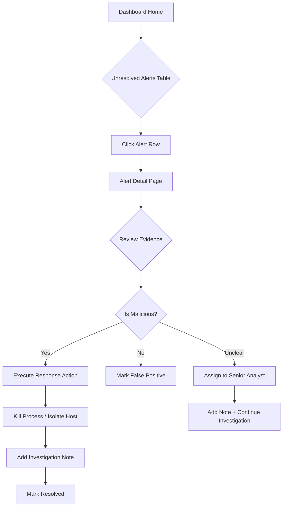
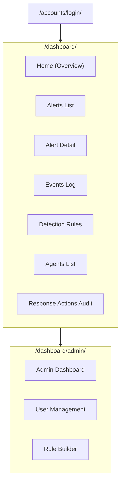

# EDR System — Complete Design & Front-End Specification

> **One-line summary**: An enterprise Endpoint Detection and Response platform that collects Windows telemetry, detects threats via configurable rules, and enables SOC analysts to investigate and remediate incidents in real-time.

---

## 1. Goals & Success Metrics

### Primary User Goals
1. **Real-time Visibility**: SOC analysts can view and analyze security events from all monitored endpoints in one dashboard.
2. **Efficient Threat Triage**: Quickly identify, prioritize, and investigate alerts by severity, MITRE ATT&CK mapping, and evidence.
3. **Rapid Response**: Execute response actions (kill process, isolate host) directly from the dashboard without needing endpoint access.

### Business Goals
1. **Reduce Mean Time to Detect (MTTD)**: Automate threat detection with rule-based engine mapped to MITRE ATT&CK.
2. **Reduce Mean Time to Respond (MTTR)**: Enable one-click remediation actions from the SOC dashboard.

### Measurable KPIs

| Metric | Target | Measurement |
|--------|--------|-------------|
| Agent uptime | >99.5% | Heartbeat success rate |
| Alert detection latency | <5 seconds | Event timestamp → Alert creation |
| Dashboard load time | <2 seconds | Time to First Contentful Paint |
| False positive rate | <10% per rule | Alerts marked FALSE_POSITIVE / Total alerts |
| Response action success rate | >95% | Successful commands / Total commands |
| Analyst resolution time | <30 minutes (Critical) | First detected → Resolved timestamp |

---

## 2. Personas & Scenarios

### 2.1 Primary Personas

| Persona | Role | Goals | Tech Comfort |
|---------|------|-------|--------------|
| **Sarah Chen** | SOC Analyst (Tier 1) | Triage incoming alerts, escalate critical threats, document findings | High — familiar with SIEM/EDR tools |
| **Marcus Wright** | SOC Lead / Admin | Create detection rules, manage users, review response action audit logs | Expert — writes detection rules |
| **Alex Rivera** | IT Security Manager | View executive dashboards, track team KPIs, ensure compliance | Medium — prefers summaries over raw data |

### 2.2 Real-World Scenarios

#### Scenario 1: Critical Alert Triage (Sarah)
Sarah receives a notification of a CRITICAL alert for "Encoded PowerShell Execution" on host `WORKSTATION-42`. She:
1. Opens the alert detail page
2. Reviews evidence (command line, user, PID)
3. Verifies it's malicious → clicks "Kill Process" with PID from evidence
4. Adds investigation note → marks as RESOLVED

#### Scenario 2: Rule Creation (Marcus)
Marcus identifies a new attack technique. He:
1. Opens Admin → Rule Builder
2. Creates rule with conditions (EventType = 1, CommandLine contains "-ep bypass")
3. Sets severity = HIGH, maps to MITRE T1059.001
4. Saves as TESTING → monitors for false positives → promotes to PRODUCTION

#### Scenario 3: Executive Review (Alex)
Alex prepares for a security review. She:
1. Views dashboard overview (total events, active rules, unresolved alerts)
2. Filters alerts by last 30 days → exports for report
3. Reviews response action audit trail for compliance

---

## 3. User Journeys & Flows

### 3.1 Alert Investigation Flow



### 3.2 Entry Points
- **Primary**: Dashboard Home (`/dashboard/`)
- **Direct Alert Link**: Alert Detail (`/dashboard/alerts/{alert_id}/`)
- **Search**: Global omnisearch (Ctrl+K)
- **Email/Webhook Notification**: Deep link to specific alert

### 3.3 Happy Path (Critical Alert Response)
1. User logs in → redirects to Dashboard Home
2. Sees "4 Unresolved" badge → scans table sorted by severity
3. Clicks CRITICAL alert → views evidence (encoded PowerShell command)
4. Clicks "Kill Process" → enters PID from evidence → confirms
5. Command queued → toast notification shows command ID
6. Adds note: "Killed malware dropper" → clicks "Mark Resolved"
7. Alert status changes to RESOLVED → removed from unresolved list

### 3.4 Alternate/Error Paths

| Path | Trigger | Handling |
|------|---------|----------|
| **Agent Offline** | Response action on disconnected agent | Show warning modal: "Agent offline. Command will execute when agent reconnects." Allow proceed or cancel. |
| **Invalid PID** | User enters non-existent PID | Agent returns error → toast: "Process not found or already terminated" |
| **Permission Denied** | SOC Viewer attempts action | Disable action buttons, show: "Read-only access. Contact analyst." |

---

## 4. Information Architecture & Sitemap



### Navigation Structure

| Nav Item | Route | Access |
|----------|-------|--------|
| Dashboard | `/dashboard/` | All authenticated users |
| Alerts | `/dashboard/alerts/` | All authenticated users |
| Events | `/dashboard/events/` | All authenticated users |
| Rules | `/dashboard/rules/` | All authenticated users (view), Analyst+ (toggle) |
| Agents | `/dashboard/agents/` | All authenticated users |
| Response Actions | `/dashboard/response-actions/` | All authenticated users |
| Admin Panel | `/dashboard/admin/` | Superuser only |

---

## 5. Screen List & Priority

| Priority | Screen | Purpose |
|----------|--------|---------|
| **MUST** | Dashboard Home | Central hub: stats cards, alert chart, recent unresolved alerts, quick actions |
| **MUST** | Alert Detail | Full investigation view: evidence, timeline, notes, response actions |
| **MUST** | Alerts List | Paginated table with bulk actions, filtering, search |
| **MUST** | Login | Authentication entry point |
| **SHOULD** | Agents List | View all registered endpoints, online status, version |
| **SHOULD** | Rules List | View/toggle detection rules |
| **SHOULD** | Events Log | Browse raw telemetry events |
| **SHOULD** | Rule Builder | Create/edit detection rules (Admin) |
| **SHOULD** | User Management | Create/edit users and roles (Admin) |
| **NICE-TO-HAVE** | Response Actions Audit | Historical log of all response actions |
| **NICE-TO-HAVE** | Executive Dashboard | Summary charts for management |

---

## 6. Component Inventory (Design System)

### 6.1 Atomic Components

#### Buttons

| Variant | Props | States | A11y |
|---------|-------|--------|------|
| Primary | `size: sm/md/lg`, `disabled`, `loading` | default, hover, active, disabled, loading | `role="button"`, `aria-disabled`, focus ring |
| Secondary | Same + `outlined` | Same | Same |
| Danger | Same | Same | Confirm before destructive actions |
| Gradient | `gradient: primary/success/warning/danger` | Same | Sufficient contrast ratio |

```css
/* Button Tokens */
--btn-radius: 25px;
--btn-padding-sm: 8px 16px;
--btn-padding-md: 12px 24px;
--btn-padding-lg: 15px 30px;
```

#### Badges

| Variant | Use Case |
|---------|----------|
| Severity (Critical/High/Medium/Low) | Alert severity indication |
| Status (Live, Online, Offline) | Agent/system status |
| Count | Numeric indicators |

```css
.badge-critical { background: linear-gradient(135deg, #ff6b6b, #ee5a6f); box-shadow: 0 0 10px rgba(255, 107, 107, 0.5); }
.badge-high { background: linear-gradient(135deg, #ff8c00, #ffa500); }
.badge-medium { background: linear-gradient(135deg, #ffd93d, #ffb400); }
.badge-low { background: linear-gradient(135deg, #51cf66, #37b24d); }
```

#### Cards

| Type | Usage |
|------|-------|
| Stat Card | Dashboard KPI display with gradient background, icon, value |
| Info Card | Alert detail sections (Rule Info, Affected System) |
| Rule Card | Rules list item with toggle |
| Note Card | Investigation notes |

#### Form Inputs

| Component | Props | Validation | A11y |
|-----------|-------|------------|------|
| Text Input | `placeholder`, `disabled`, `error` | Required, email format | `aria-label`, `aria-describedby` for errors |
| Search Box | `debounce: 300ms` | N/A | `role="searchbox"` |
| Select | `options[]`, `multi` | Required | `aria-expanded`, keyboard nav |
| Checkbox | `checked`, `indeterminate` | N/A | `aria-checked` |
| Textarea | `rows`, `maxLength` | Required, max length | Same as text |

#### Tables

| Feature | Implementation |
|---------|----------------|
| Row hover | Gradient highlight + slight scale |
| Row selection | Checkbox column |
| Sorting | Click header → asc/desc/none cycle |
| Pagination | Bottom bar with page numbers |

#### Modals

| Type | Trigger | Content |
|------|---------|---------|
| Confirmation Modal | Destructive actions | Icon, title, message, Cancel/Confirm |
| Input Modal | Assign analyst, add note | Form fields + buttons |
| Response Action Modal | Kill process, isolate host | PID input (conditional), reason textarea |

#### Toast Notifications

| Type | Icon | Color |
|------|------|-------|
| Success | ✓ check-circle | Green gradient |
| Error | ✗ exclamation-circle | Red/orange gradient |
| Warning | ⚠ exclamation-triangle | Yellow gradient |
| Info | ℹ info-circle | Blue gradient |

```js
// Toast API
showToast(message, type = 'success', duration = 5000)
```

#### Charts

| Type | Library | Usage |
|------|---------|-------|
| Doughnut | Chart.js | Alert status (resolved vs unresolved) |
| Line/Area | Chart.js | Event volume over time |

### 6.2 Accessibility Notes (All Components)

- **Keyboard Navigation**: All interactive elements focusable via Tab
- **Focus Indicators**: 3px outline with primary color
- **Screen Readers**: Semantic HTML, ARIA labels, live regions for toasts
- **Color Contrast**: Minimum 4.5:1 for text, 3:1 for UI elements

---

## 7. Data & API Contracts

### 7.1 Authentication

All API endpoints require authentication except `/accounts/login/`.

| Method | Description |
|--------|-------------|
| Session Cookie | Django session auth for dashboard |
| Token Header | `Authorization: Bearer <token>` for agent APIs |

### 7.2 Agent Communication APIs

#### POST /api/v1/telemetry/
Submit telemetry events from agent.

**Request:**
```json
{
  "agent_id": "550e8400-e29b-41d4-a716-446655440000",
  "agent_version": "1.2.0",
  "events": [
    {
      "EventType": 1,
      "UtcTime": "2024-12-09T02:05:00.000Z",
      "ProcessId": 4523,
      "Image": "C:\\Windows\\System32\\powershell.exe",
      "CommandLine": "powershell.exe -enc SGVsbG8gV29ybGQ=",
      "User": "DOMAIN\\user",
      "Hostname": "WORKSTATION-42"
    }
  ]
}
```

**Response (201 Created):**
```json
{
  "status": "accepted",
  "events_received": 1,
  "task_id": "abc123-task-id"
}
```

**Error Responses:**
| Code | Body | Cause |
|------|------|-------|
| 401 | `{"error": "Invalid token"}` | Missing/invalid auth |
| 400 | `{"error": "Validation failed", "details": {...}}` | Invalid event format |
| 429 | `{"error": "Rate limit exceeded"}` | >200 requests/10s |

#### GET /api/v1/commands/poll/
Agent polls for pending commands.

**Headers:** `Authorization: Bearer <token>`  
**Query:** `?agent_id=<uuid>`

**Response (200 OK):**
```json
{
  "commands": [
    {
      "command_id": "cmd-uuid-123",
      "command_type": "kill_process",
      "parameters": {"pid": 4523},
      "issued_by": "analyst@company.com"
    }
  ]
}
```

**Response (204 No Content):** No pending commands.

#### POST /api/v1/commands/result/{command_id}/
Agent reports command execution result.

**Request:**
```json
{
  "status": "success",
  "message": "Process 4523 terminated successfully",
  "executed_at": "2024-12-09T02:10:00.000Z"
}
```

**Response (200 OK):**
```json
{"acknowledged": true}
```

#### POST /api/v1/heartbeat/
Agent heartbeat with system metrics.

**Request:**
```json
{
  "agent_id": "550e8400-e29b-41d4-a716-446655440000",
  "cpu_percent": 12.5,
  "memory_mb": 2048,
  "uptime_seconds": 86400,
  "events_sent": 1523
}
```

**Response (200 OK):**
```json
{"status": "ok", "config_version": 1}
```

### 7.3 Dashboard APIs

#### GET /api/v1/dashboard/stats/
Dashboard summary statistics.

**Response:**
```json
{
  "total_events": 125000,
  "total_alerts": 450,
  "unresolved_alerts": 23,
  "active_rules": 15,
  "total_rules": 20,
  "agents_online": 8,
  "agents_total": 12
}
```

#### GET /api/v1/dashboard/alerts/
List alerts with optional filters.

**Query Parameters:**
| Param | Type | Default | Description |
|-------|------|---------|-------------|
| status | string | all | UNRESOLVED, RESOLVED, FALSE_POSITIVE |
| severity | string | all | CRITICAL, HIGH, MEDIUM, LOW |
| page | int | 1 | Pagination |
| limit | int | 50 | Max results per page |
| search | string | | Search in alert_id, rule_name, hostname |

**Response:**
```json
{
  "alerts": [
    {
      "alert_id": "ALT-20241209-A3F2C1",
      "severity": "CRITICAL",
      "alert_status": "UNRESOLVED",
      "rule_id": "RULE-T1059-001",
      "rule_name": "Encoded PowerShell Execution",
      "endpoint_id": "550e8400-...",
      "hostname": "WORKSTATION-42",
      "first_detected": "2024-12-09T02:05:00Z",
      "occurrence_count": 3
    }
  ],
  "total": 450,
  "page": 1,
  "pages": 9
}
```

#### GET /api/v1/dashboard/alerts/{alert_id}/
Single alert detail.

**Response:**
```json
{
  "alert_id": "ALT-20241209-A3F2C1",
  "severity": "CRITICAL",
  "confidence": 0.95,
  "alert_status": "UNRESOLVED",
  "rule_id": "RULE-T1059-001",
  "rule_name": "Encoded PowerShell Execution",
  "endpoint_id": "550e8400-...",
  "hostname": "WORKSTATION-42",
  "mitre_techniques": ["T1059.001"],
  "evidence_summary": {
    "process_name": "powershell.exe",
    "command_line": "powershell.exe -enc SGVsbG8gV29ybGQ=",
    "pid": 4523,
    "user": "DOMAIN\\user"
  },
  "first_detected": "2024-12-09T02:05:00Z",
  "last_detected": "2024-12-09T02:07:00Z",
  "occurrence_count": 3,
  "notes": [],
  "assigned_analyst": null
}
```

#### POST /api/v1/dashboard/alerts/{alert_id}/status/
Update alert status.

**Request:**
```json
{
  "status": "RESOLVED",
  "note": "Killed malicious process and cleaned up"
}
```

**Response:**
```json
{"success": true, "new_status": "RESOLVED"}
```

#### POST /api/v1/dashboard/alerts/{alert_id}/assign/
Assign alert to analyst.

**Request:**
```json
{"analyst_email": "sarah@company.com"}
```

**Response:**
```json
{"success": true, "assigned_to": "sarah@company.com"}
```

#### POST /api/v1/dashboard/alerts/{alert_id}/note/
Add investigation note.

**Request:**
```json
{"note": "Investigated parent process tree. Confirmed malicious."}
```

**Response:**
```json
{
  "success": true,
  "note": {
    "timestamp": "2024-12-09T02:15:00Z",
    "analyst": "sarah@company.com",
    "note": "Investigated parent process tree. Confirmed malicious."
  }
}
```

#### POST /api/v1/alerts/bulk/
Bulk actions on multiple alerts.

**Request:**
```json
{
  "alert_ids": ["ALT-1", "ALT-2", "ALT-3"],
  "action": "resolve",
  "value": "Bulk resolved after investigation"
}
```

**Actions:** `resolve`, `false_positive`, `assign`

**Response:**
```json
{
  "success": true,
  "processed": 3,
  "failed": 0
}
```

### 7.4 Response Action APIs

#### POST /api/v1/response/kill_process/
Queue kill process command.

**Request:**
```json
{
  "agent_id": "550e8400-...",
  "pid": 4523,
  "alert_id": "ALT-20241209-A3F2C1",
  "reason": "Encoded PowerShell detected - malware dropper"
}
```

**Response (201 Created):**
```json
{
  "status": "queued",
  "command_id": "cmd-uuid-456",
  "message": "Kill process command queued for agent"
}
```

#### POST /api/v1/response/isolate_host/
Queue host isolation command.

**Request:**
```json
{
  "agent_id": "550e8400-...",
  "reason": "Active ransomware detected - preventing lateral movement"
}
```

**Response:** Same structure as kill_process.

#### POST /api/v1/response/deisolate_host/
Queue host de-isolation command.

**Request:**
```json
{
  "agent_id": "550e8400-...",
  "reason": "Host cleaned, restoring network access"
}
```

**Response:** Same structure as kill_process.

### 7.5 Rate Limits

| Endpoint | Limit | Window |
|----------|-------|--------|
| `/api/v1/telemetry/` | 200 requests | 10 seconds |
| Dashboard APIs | 100 requests | 1 minute |
| Response Action APIs | 10 requests | 1 minute |

---

## 8. State & Edge Cases

### 8.1 Client State Machines

#### Alert List Loading
```
IDLE → LOADING → SUCCESS | ERROR
                ↓
           (data displayed)
                ↓
        REFRESHING → SUCCESS | ERROR
```

#### Response Action Execution
```
IDLE → CONFIRMING → SUBMITTING → QUEUED | ERROR
                         ↓
                    (toast shown)
                         ↓
               (poll for result) → SUCCESS | FAILED | TIMEOUT
```

### 8.2 Empty / Error / Offline States

| Screen | Empty State | Error State | Offline State |
|--------|-------------|-------------|---------------|
| Dashboard Home | "No events received yet. Ensure agents are configured." | "Failed to load stats. [Retry]" | "You appear to be offline. Showing cached data." |
| Alerts List | "🎉 No unresolved alerts. Your system is secure!" | "Failed to load alerts. [Retry]" | Same as above |
| Alert Detail | (404) "Alert not found or has been deleted." | "Failed to load alert details. [Retry]" | — |
| Agents List | "No agents registered yet. Deploy agents to endpoints." | "Failed to load agent list. [Retry]" | — |

### 8.3 Permission States

| Role | Can View | Can Take Actions | Can Admin |
|------|----------|------------------|-----------|
| SOC Viewer | ✓ All pages | ✗ Read-only | ✗ |
| SOC Analyst | ✓ All pages | ✓ All actions | ✗ |
| Superuser | ✓ All pages | ✓ All actions | ✓ Full admin |

---

## 9. Interaction & Microcopy

### 9.1 Primary CTAs

| Action | Button Label | Confirmation Message |
|--------|--------------|----------------------|
| Resolve Alert | "Mark Resolved" | "Mark this alert as resolved? This indicates the threat has been addressed." |
| False Positive | "Mark False Positive" | "Mark this as a false positive? This indicates no actual threat was present." |
| Kill Process | "Kill Process" | "Kill process {PID} on {hostname}? This action cannot be undone." |
| Isolate Host | "Isolate Host" | "ISOLATE host {hostname} from the network? All network traffic will be blocked except EDR communication." |
| De-isolate Host | "De-Isolate Host" | "RESTORE NETWORK for host {hostname}? Normal network access will be restored." |

### 9.2 Success / Error Messages

| Scenario | Toast Message |
|----------|---------------|
| Alert resolved | "✅ Alert marked as resolved successfully!" |
| Command queued | "✅ Command queued! ID: cmd-abc123" |
| Invalid PID | "❌ No PID available. Please enter a Process ID to kill." |
| Permission denied | "🔒 You don't have permission to perform this action." |
| Network error | "❌ Network error. Please check your connection." |
| Agent offline | "⚠️ Agent is offline. Command will execute when agent reconnects." |

### 9.3 Inline Help

| Control | Tooltip |
|---------|---------|
| PID Input | "💡 You can find the PID in Task Manager or the alert evidence" |
| Severity Filter | "Filter alerts by threat severity level" |
| Auto-refresh countdown | "Dashboard refreshes automatically every 30 seconds" |

---

## 10. Accessibility, Internationalization, & Legal

### 10.1 WCAG Checklist (Per Screen)

| Requirement | Implementation |
|-------------|----------------|
| **1.1.1 Non-text Content** | Alt text for icons (via `aria-label`), charts have tabular alternative |
| **1.4.3 Contrast** | Minimum 4.5:1 for body text, 3:1 for large text |
| **1.4.11 Non-text Contrast** | UI components meet 3:1 ratio |
| **2.1.1 Keyboard** | All interactive elements reachable via Tab, Enter/Space to activate |
| **2.4.4 Link Purpose** | Links have descriptive text or `aria-label` |
| **2.4.7 Focus Visible** | Custom focus ring on all interactive elements |
| **4.1.2 Name, Role, Value** | Form inputs have labels, buttons have `role="button"`, modals have `role="dialog"` |

### 10.2 Internationalization (i18n)

| Consideration | Guideline |
|---------------|-----------|
| Text expansion | Allow 200% expansion for German/Russian (avoid fixed-width containers) |
| RTL support | CSS logical properties (`margin-inline-start` vs `margin-left`) |
| Date/time | Use user's locale for formatting (`Intl.DateTimeFormat`) |
| Numbers | Use locale-aware formatting for large numbers |
| Pluralization | Use ICU MessageFormat for "1 alert" vs "X alerts" |

### 10.3 Privacy / Security / Legal

| Area | Requirement |
|------|-------------|
| **PII Handling** | Usernames, hostnames visible only to authenticated users. API responses don't expose more data than needed. |
| **Audit Trail** | All response actions logged with user, timestamp, reason. Logs retained per compliance policy. |
| **Session Security** | CSRF protection on all POST endpoints. Session timeout after 30 min inactivity. |
| **Data Retention** | Telemetry events: 90 days. Alerts: 1 year. Response actions: Indefinite (compliance). |
| **Consent** | Endpoint monitoring requires employee notification per company policy. |

---

## 11. Visual & UX Guidelines

### 11.1 Layout Grid

```
| Content Area: 12-column grid, max-width: 1400px, centered |
| Gutter: 24px | Margin: 16px (mobile), 24px (tablet), 32px (desktop) |
```

**Breakpoints:**
| Breakpoint | Width | Columns |
|------------|-------|---------|
| Mobile | <576px | 4 |
| Tablet | 576-991px | 8 |
| Desktop | ≥992px | 12 |

### 11.2 Spacing Scale

```css
--spacing-1: 4px;
--spacing-2: 8px;
--spacing-3: 12px;
--spacing-4: 16px;
--spacing-5: 24px;
--spacing-6: 32px;
--spacing-7: 48px;
--spacing-8: 64px;
```

### 11.3 Typography Scale

| Element | Size | Weight | Line Height |
|---------|------|--------|-------------|
| H1 | 32px | 700 | 1.2 |
| H2 | 24px | 600 | 1.3 |
| H3 | 20px | 600 | 1.4 |
| H4/H5 | 16px | 600 | 1.4 |
| Body | 14px | 400 | 1.6 |
| Small | 12px | 400 | 1.5 |

**Font Stack:** `Inter, -apple-system, BlinkMacSystemFont, 'Segoe UI', Roboto, sans-serif`

### 11.4 Color Tokens

```css
/* Primary Gradients */
--gradient-primary: linear-gradient(135deg, #667eea 0%, #764ba2 100%);
--gradient-success: linear-gradient(135deg, #11998e 0%, #38ef7d 100%);
--gradient-warning: linear-gradient(135deg, #f093fb 0%, #f5576c 100%);
--gradient-danger: linear-gradient(135deg, #fa709a 0%, #fee140 100%);

/* Severity Colors */
--color-critical: #ff6b6b;
--color-high: #ff8c00;
--color-medium: #ffd93d;
--color-low: #51cf66;

/* Neutral */
--color-bg: #f8f9fa;
--color-surface: #ffffff;
--color-border: #e0e0e0;
--color-text-primary: #2d3436;
--color-text-secondary: #636e72;
```

### 11.5 Iconography

**Library:** Font Awesome 6 (Free)

| Category | Icons |
|----------|-------|
| Navigation | `fa-shield-alt`, `fa-exclamation-circle`, `fa-list`, `fa-cog`, `fa-users` |
| Actions | `fa-check-circle`, `fa-times-circle`, `fa-user-plus`, `fa-skull`, `fa-network-wired` |
| Status | `fa-circle` (live), `fa-heartbeat`, `fa-clock`, `fa-arrow-up/down` |
| Severity | `fa-exclamation-triangle`, `fa-exclamation-circle`, `fa-info-circle`, `fa-check-circle` |

### 11.6 Motion & Animation

| Transition | Duration | Easing | Usage |
|------------|----------|--------|-------|
| Hover lift | 300ms | ease | Cards, buttons |
| Modal entrance | 300ms | ease-out | Slide up + fade |
| Toast entrance | 300ms | ease-out | Slide from right |
| Progress bar | 500ms | ease-in-out | Loading states |
| Bulk action bar | 400ms | cubic-bezier(0.68, -0.55, 0.265, 1.55) | Slide up with bounce |

---

## 12. Wireframe Deliverables

### 12.1 Low-Fidelity Wireframes (ASCII Sketches)

#### Dashboard Home

```
┌──────────────────────────────────────────────────────────────────────┐
│  🛡️ Security Operations Center                         [🔴 LIVE] [↻] │
├──────────────────────────────────────────────────────────────────────┤
│ ┌─────────────┐ ┌─────────────┐ ┌─────────────┐ ┌─────────────┐     │
│ │ Total Events│ │ Active Rules│ │ Total Alerts│ │  Unresolved │     │
│ │   125,000   │ │     15      │ │     450     │ │     23      │     │
│ └─────────────┘ └─────────────┘ └─────────────┘ └─────────────┘     │
├──────────────────────────────────────────────────────────────────────┤
│ ┌────────────────────────────────────────────────────────────────┐  │
│ │  📊 Alert Overview   [Doughnut Chart: Resolved vs Unresolved]  │  │
│ └────────────────────────────────────────────────────────────────┘  │
├──────────────────────────────────────────────────────────────────────┤
│ ┌────────────────────────────────────────────────────────────────┐  │
│ │  ⚠️ Recent Unresolved Alerts                                   │  │
│ │  ┌──────────────────────────────────────────────────────────┐  │  │
│ │  │ [Filter: All ⌄]  [Time: 24h ⌄]  [🔍 Search alerts...]    │  │  │
│ │  └──────────────────────────────────────────────────────────┘  │  │
│ │  ┌────┬──────────┬──────────┬────────────┬──────────┬───────┐  │  │
│ │  │ ☐  │ Alert ID │ Severity │ Rule       │ Endpoint │ Time  │  │  │
│ │  ├────┼──────────┼──────────┼────────────┼──────────┼───────┤  │  │
│ │  │ ☐  │ ALT-001  │ 🔴 CRIT  │ PowerShell │ WS-42    │ 5m    │  │  │
│ │  │ ☐  │ ALT-002  │ 🟠 HIGH  │ Mimikatz   │ DC-01    │ 12m   │  │  │
│ │  │ ☐  │ ALT-003  │ 🟡 MED   │ Suspicious │ WS-15    │ 1h    │  │  │
│ │  └────┴──────────┴──────────┴────────────┴──────────┴───────┘  │  │
│ └────────────────────────────────────────────────────────────────┘  │
├──────────────────────────────────────────────────────────────────────┤
│ ┌──────────────────────────┐  ┌────────────────────────────────────┐│
│ │ 🛡️ Active Detection Rules │  │ ❤️ System Status                   ││
│ │ ┌──────────────────────┐ │  │ [======85%======] Rules Active     ││
│ │ │ RULE-001 PowerShell  │ │  │ Auto-refresh: [30s]                ││
│ │ │ RULE-002 Mimikatz    │ │  ├────────────────────────────────────┤│
│ │ └──────────────────────┘ │  │ ⚡ Quick Actions                    ││
│ └──────────────────────────┘  │ [Manage Rules] [View Events]       ││
│                                └────────────────────────────────────┘│
└──────────────────────────────────────────────────────────────────────┘

┌──────────────────────────────────────────────────┐  (Floating Bar)
│ 3 selected  [✓ Resolve] [✗ False Positive] [👤 Assign] [×] │
└──────────────────────────────────────────────────┘
```

#### Alert Detail

```
┌──────────────────────────────────────────────────────────────────────┐
│ ← Back to Dashboard                                                  │
├──────────────────────────────────────────────────────────────────────┤
│ ┌────────────────────────────────────────────────────────────────┐  │
│ │  ⚠️ ALT-20241209-A3F2C1                    🔴 CRITICAL         │  │
│ │  Security Alert Detection                  🟡 UNRESOLVED       │  │
│ └────────────────────────────────────────────────────────────────┘  │
├──────────────────────────────────────────────────────────────────────┤
│ ┌─────────────────────────────┐ ┌─────────────────────────────────┐ │
│ │ 🛡️ Rule Information         │ │ 💻 Affected System              │ │
│ │ ID: RULE-T1059-001          │ │ Endpoint: 550e8400-...          │ │
│ │ Name: Encoded PowerShell    │ │ Hostname: WORKSTATION-42        │ │
│ │ Confidence: [====95%====]   │ │ MITRE: [T1059.001]              │ │
│ └─────────────────────────────┘ └─────────────────────────────────┘ │
├──────────────────────────────────────────────────────────────────────┤
│ 🔍 Threat Evidence                                                   │
│ ┌────────────────────────────────────────────────────────────────┐  │
│ │ PROCESS_NAME: powershell.exe                                   │  │
│ │ COMMAND_LINE: powershell.exe -enc SGVsbG8gV29ybGQ=             │  │
│ │ PID: 4523                                                      │  │
│ │ USER: DOMAIN\user                                              │  │
│ └────────────────────────────────────────────────────────────────┘  │
├──────────────────────────────────────────────────────────────────────┤
│ 🕐 Detection Timeline                                                │
│ ┌────────────────────────────────────────────────────────────────┐  │
│ │ First Detected: Dec 9, 2024 - 2:05 AM                          │  │
│ │ Last Detected: Dec 9, 2024 - 2:07 AM                           │  │
│ │ Occurrences: 3                                                 │  │
│ └────────────────────────────────────────────────────────────────┘  │
├──────────────────────────────────────────────────────────────────────┤
│ 🛠️ SOC Response Actions                                             │
│ [✓ Mark Resolved] [✗ False Positive] [👤 Assign]                    │
│ [💀 Kill Process] [🌐 Isolate Host] [📶 De-Isolate Host]            │
├──────────────────────────────────────────────────────────────────────┤
│ 📋 Investigation Notes                                               │
│ ┌────────────────────────────────────────────────────────────────┐  │
│ │ No investigation notes yet. Add your findings below.           │  │
│ └────────────────────────────────────────────────────────────────┘  │
│ ┌────────────────────────────────────────────────────┐ [+ Add Note]  │
│ │ Add your investigation note here...                │              │
│ └────────────────────────────────────────────────────┘              │
└──────────────────────────────────────────────────────────────────────┘
```

### 12.2 High-Fidelity Mocks (File List)

| Frame | Variants | States |
|-------|----------|--------|
| `dashboard_home_desktop.fig` | Desktop (1440px) | Default, Alerts Selected, Action Bar Visible |
| `dashboard_home_tablet.fig` | Tablet (768px) | Default |
| `dashboard_home_mobile.fig` | Mobile (375px) | Default, Menu Open |
| `alert_detail_desktop.fig` | Desktop | Default, Modal Open (Resolve/Kill/Isolate) |
| `alerts_list_desktop.fig` | Desktop | Default, Filtered, Empty, Loading |
| `login_page.fig` | Desktop, Mobile | Default, Error State, Loading |
| `agents_list_desktop.fig` | Desktop | Default, Empty |
| `rules_list_desktop.fig` | Desktop | Default, Empty |
| `admin_rule_builder.fig` | Desktop | Create Mode, Edit Mode |

### 12.3 Responsive Breakpoints

| Screen | Desktop (≥992px) | Tablet (768-991px) | Mobile (<768px) |
|--------|------------------|--------------------|-----------------| 
| Dashboard | 4-col stat cards | 2-col stat cards | Stacked cards |
| Alerts Table | Full columns | Hide some columns | Card-based list |
| Alert Detail | Side-by-side info cards | Stacked | Stacked |

---

## 13. Handoff Artifacts for Developers

### 13.1 Figma Component Library Structure

```
📁 EDR Design System
├── 📁 Foundations
│   ├── Colors
│   ├── Typography
│   ├── Spacing
│   ├── Shadows
│   └── Icons
├── 📁 Components
│   ├── Buttons/
│   │   ├── Button/Primary
│   │   ├── Button/Secondary
│   │   ├── Button/Danger
│   │   └── Button/Gradient
│   ├── Badges/
│   │   ├── Badge/Severity/Critical
│   │   ├── Badge/Severity/High
│   │   ├── Badge/Severity/Medium
│   │   └── Badge/Severity/Low
│   ├── Cards/
│   │   ├── Card/Stat
│   │   ├── Card/Info
│   │   ├── Card/Rule
│   │   └── Card/Note
│   ├── Forms/
│   │   ├── Input/Text
│   │   ├── Input/Search
│   │   ├── Select
│   │   ├── Checkbox
│   │   └── Textarea
│   ├── Modals/
│   │   ├── Modal/Confirm
│   │   ├── Modal/Input
│   │   └── Modal/ResponseAction
│   ├── Tables/
│   │   └── Table/Alerts
│   └── Toasts/
│       ├── Toast/Success
│       ├── Toast/Error
│       └── Toast/Warning
└── 📁 Pages
    ├── Dashboard/Home
    ├── Dashboard/AlertDetail
    ├── Dashboard/AlertsList
    └── Auth/Login
```

### 13.2 Storybook Stories Template

```jsx
// Button.stories.jsx
import { Button } from './Button';

export default {
  title: 'Components/Button',
  component: Button,
  argTypes: {
    variant: {
      control: 'select',
      options: ['primary', 'secondary', 'danger', 'gradient'],
    },
    size: {
      control: 'select',
      options: ['sm', 'md', 'lg'],
    },
    disabled: { control: 'boolean' },
    loading: { control: 'boolean' },
  },
};

const Template = (args) => <Button {...args} />;

export const Primary = Template.bind({});
Primary.args = {
  variant: 'primary',
  size: 'md',
  children: 'Mark Resolved',
};

export const Danger = Template.bind({});
Danger.args = {
  variant: 'danger',
  size: 'md',
  children: 'Kill Process',
};

export const Loading = Template.bind({});
Loading.args = {
  variant: 'primary',
  size: 'md',
  loading: true,
  children: 'Processing...',
};
```

### 13.3 Build Notes

| Area | Recommendation |
|------|----------------|
| **Framework** | Django templates + vanilla JS (existing), migrate to React/Next.js for future redesign |
| **CSS Strategy** | CSS custom properties for tokens, BEM naming for components |
| **Icons** | Font Awesome 6 via CDN |
| **Charts** | Chart.js (already integrated) |
| **A11y Testing** | axe-core browser extension, pa11y-ci in CI pipeline |
| **Browser Support** | Chrome 90+, Firefox 88+, Safari 14+, Edge 90+ |

---

## 14. Prototype & Testing Plan

### 14.1 Clickable Prototype Scope

| Flow | Screens | Interactions |
|------|---------|--------------|
| Alert Triage | Dashboard → Alert List → Alert Detail | Click rows, filters, bulk select |
| Response Action | Alert Detail → Kill Process Modal → Toast | Button click, form input, confirm |
| Bulk Operations | Dashboard → Select alerts → Floating bar → Resolve | Checkbox, bulk action bar |

### 14.2 Usability Test Script

**Participants:** 5 SOC analysts (internal or external)  
**Duration:** 45 minutes per session

| Task # | Task | Success Criteria | Time Limit |
|--------|------|------------------|------------|
| 1 | "Find all CRITICAL alerts from the last 24 hours" | Uses severity filter + time filter | 2 min |
| 2 | "Investigate alert ALT-001 and tell me what process caused it" | Navigates to detail, identifies process from evidence | 3 min |
| 3 | "Kill the malicious process from the alert" | Opens modal, enters PID, confirms action | 2 min |
| 4 | "Mark the alert as resolved with a note" | Adds note, clicks resolve | 2 min |
| 5 | "Bulk resolve alerts ALT-002 and ALT-003" | Uses checkboxes + floating bar | 2 min |
| 6 | "Find if agent WORKSTATION-42 is online" | Navigates to Agents list, finds agent | 2 min |
| 7 | "Toggle off rule RULE-002" | Navigates to Rules, clicks toggle | 2 min |
| 8 | "What actions were taken yesterday?" | Navigates to Response Actions audit trail | 2 min |

### 14.3 Metrics to Capture

| Metric | Measurement |
|--------|-------------|
| Task completion rate | % of tasks completed successfully |
| Time on task | Seconds to complete each task |
| Error rate | Number of wrong clicks/paths |
| SUS Score | System Usability Scale (post-test survey) |
| Qualitative feedback | Think-aloud observations, pain points |

---

## 15. QA & Acceptance Criteria

### 15.1 Per-Screen Acceptance Checklist

#### Dashboard Home

| Category | Criteria | Pass/Fail |
|----------|----------|-----------|
| **Visual** | Stat cards display correct values from API | ☐ |
| **Visual** | Chart renders with correct data | ☐ |
| **Visual** | Gradient colors match spec | ☐ |
| **Functional** | Alerts table loads and displays | ☐ |
| **Functional** | Severity filter works client-side | ☐ |
| **Functional** | Search filters table rows | ☐ |
| **Functional** | Bulk selection shows floating bar | ☐ |
| **Functional** | Auto-refresh triggers every 30s | ☐ |
| **A11y** | All interactive elements keyboard accessible | ☐ |
| **A11y** | Screen reader announces dynamic content | ☐ |
| **API** | `/api/v1/dashboard/stats/` returns correct schema | ☐ |

#### Alert Detail

| Category | Criteria | Pass/Fail |
|----------|----------|-----------|
| **Visual** | Evidence displays in formatted boxes | ☐ |
| **Visual** | Timeline shows correct dates | ☐ |
| **Functional** | Mark Resolved updates status | ☐ |
| **Functional** | Kill Process modal validates PID input | ☐ |
| **Functional** | Add Note appends to notes list | ☐ |
| **A11y** | Modal traps focus | ☐ |
| **A11y** | Toast announced by screen reader | ☐ |
| **API** | `/api/v1/dashboard/alerts/{id}/status/` accepts POST | ☐ |

### 15.2 Regression Test Cases

| Test ID | Scenario | Expected Result |
|---------|----------|-----------------|
| REG-001 | Load dashboard with 1000+ alerts | Page loads in <3s, table renders |
| REG-002 | Submit telemetry with invalid token | Returns 401, no data saved |
| REG-003 | Kill process on offline agent | Command queued, warning shown |
| REG-004 | Concurrent bulk resolve by 2 users | Both succeed, no duplicates |
| REG-005 | Session timeout after 30 min | Redirects to login |

---

## 16. Timeline & Resource Estimate

### 16.1 Effort Estimates (Person-Hours)

| Phase | Task | Hours |
|-------|------|-------|
| **Design** | Low-fi wireframes (all screens) | 8h |
| **Design** | Hi-fi mocks (MUST screens) | 16h |
| **Design** | Hi-fi mocks (SHOULD screens) | 12h |
| **Design** | Prototype assembly | 4h |
| **Design** | Usability testing | 8h |
| **Development** | Component library (Storybook) | 24h |
| **Development** | Dashboard Home | 16h |
| **Development** | Alert Detail | 12h |
| **Development** | Alerts List | 10h |
| **Development** | Agents/Rules pages | 8h |
| **Development** | Admin pages | 12h |
| **QA** | Manual testing | 16h |
| **QA** | Accessibility audit | 8h |
| **Integration** | API integration fixes | 8h |
| **TOTAL** | | **162h** |

### 16.2 Minimal Viable Scope (Phase 1 Release)

| Include | Exclude |
|---------|---------|
| Dashboard Home (full) | Executive Dashboard |
| Alert Detail (full) | Advanced search (saved filters) |
| Alerts List (basic) | Correlation views |
| Response Actions (Kill, Isolate) | Automated response playbooks |
| Login | SSO integration |
| Basic RBAC | Granular permissions |

---

## 17. Risks & Mitigations

| # | Risk | Probability | Impact | Mitigation |
|---|------|-------------|--------|------------|
| 1 | **Agent offline during response action** | High | Medium | Queue commands, show clear status, allow retry |
| 2 | **False positives overwhelm analysts** | Medium | High | Tunable confidence thresholds, bulk false-positive |
| 3 | **Performance degradation with scale** | Medium | High | Pagination, virtualized tables, Redis caching |
| 4 | **Accessibility gaps in complex UI** | Medium | Medium | Early a11y audit, axe-core in CI |
| 5 | **Design-dev mismatch** | Low | Medium | Figma inspection mode, component library parity |

---

## 18. Next Steps / Actionable To-Do List

### Designer
| Priority | Task | Output |
|----------|------|--------|
| P0 | Create hi-fi mocks for Dashboard Home | `dashboard_home_desktop.fig` |
| P0 | Create hi-fi mocks for Alert Detail | `alert_detail_desktop.fig` |
| P1 | Build clickable prototype | Figma prototype link |
| P1 | Conduct usability test (5 users) | Test report |
| P2 | Design responsive variants | Tablet/mobile frames |

### Frontend Engineer
| Priority | Task | Output |
|----------|------|--------|
| P0 | Implement component library | Storybook stories |
| P0 | Refactor Dashboard Home to match designs | Updated templates |
| P1 | Add loading/error/empty states | UI states |
| P1 | Improve accessibility (ARIA, keyboard nav) | Audit fixes |
| P2 | Add client-side caching | Better offline UX |

### Backend Engineer
| Priority | Task | Output |
|----------|------|--------|
| P0 | Document API contracts in OpenAPI | `openapi.yaml` |
| P1 | Add cursor-based pagination for alerts | API update |
| P1 | Implement WebSocket for real-time alerts | Live updates |
| P2 | Add API versioning strategy | Future-proofing |

### QA
| Priority | Task | Output |
|----------|------|--------|
| P0 | Write regression tests for MUST screens | Test suite |
| P1 | Accessibility audit with axe | A11y report |
| P2 | Performance testing under load | Load test report |

### PM
| Priority | Task | Output |
|----------|------|--------|
| P0 | Review and approve designs | Sign-off |
| P1 | Schedule usability testing | Calendar invite |
| P2 | Gather feedback from SOC team | Requirements doc |

---

## Appendix: Ready-to-Paste Templates

### A.1 Figma Frame Naming Template

```
[Feature]/[Screen]/[Viewport]/[State]

Examples:
- Dashboard/Home/Desktop/Default
- Dashboard/Home/Desktop/AlertsSelected
- Dashboard/AlertDetail/Desktop/KillProcessModal
- Auth/Login/Mobile/ErrorState
```

### A.2 Storybook Story Template

```jsx
// ComponentName.stories.jsx
import { ComponentName } from './ComponentName';

export default {
  title: 'Category/ComponentName',
  component: ComponentName,
  argTypes: {
    propName: { control: 'text' },
    variant: { control: 'select', options: ['a', 'b'] },
    disabled: { control: 'boolean' },
  },
};

const Template = (args) => <ComponentName {...args} />;

export const Default = Template.bind({});
Default.args = {
  propName: 'value',
};

export const Variant = Template.bind({});
Variant.args = {
  propName: 'value',
  variant: 'b',
};
```

### A.3 Sample API Request/Response (Postman/Insomnia)

```json
// POST /api/v1/response/kill_process/
// Headers:
// Content-Type: application/json
// X-CSRFToken: {{csrf_token}}
// Cookie: sessionid={{session}}

// Request Body:
{
  "agent_id": "550e8400-e29b-41d4-a716-446655440000",
  "pid": 4523,
  "alert_id": "ALT-20241209-A3F2C1",
  "reason": "Encoded PowerShell detected - malware dropper"
}

// Response (201 Created):
{
  "status": "queued",
  "command_id": "cmd-abc123-def456",
  "message": "Kill process command queued for agent"
}

// Response (400 Bad Request):
{
  "error": "Validation failed",
  "details": {
    "pid": ["This field is required."]
  }
}

// Response (404 Not Found):
{
  "error": "Agent not found"
}
```

### A.4 Accessibility Checklist (PR Template)

```markdown
## Accessibility Checklist

Before merging, verify the following:

### Keyboard Navigation
- [ ] All interactive elements are focusable via Tab
- [ ] Focus order is logical (left-to-right, top-to-bottom)
- [ ] Focus indicator is visible (3px outline)
- [ ] Modals trap focus when open
- [ ] Escape key closes modals

### Screen Reader
- [ ] All images have alt text or aria-label
- [ ] Form inputs have associated labels
- [ ] Buttons have descriptive text
- [ ] Dynamic content uses aria-live regions
- [ ] Tables have proper headers (th)

### Visual
- [ ] Text meets 4.5:1 contrast ratio
- [ ] UI components meet 3:1 contrast ratio
- [ ] Information not conveyed by color alone
- [ ] Touch targets ≥ 44x44px on mobile

### Testing
- [ ] Tested with axe browser extension (0 violations)
- [ ] Tested keyboard-only navigation
- [ ] Tested with VoiceOver/NVDA (optional)
```

---

## Assumptions

> The following assumptions were made due to missing requirements. **Please validate and adjust as needed:**

| # | Assumption | Default Value | Impact if Wrong |
|---|------------|---------------|-----------------|
| 1 | Session timeout | 30 minutes | Security risk if too long |
| 2 | Max alerts per page | 50 | Performance if too high |
| 3 | Auto-refresh interval | 30 seconds | Server load if too low |
| 4 | Date format | Locale-aware | User confusion |
| 5 | PID is always available in evidence | Sometimes missing | Need fallback input |
| 6 | Single tenant deployment | Yes | Multi-tenant would need org scoping |
| 7 | Agent polling interval | 30 seconds | Latency for commands |
