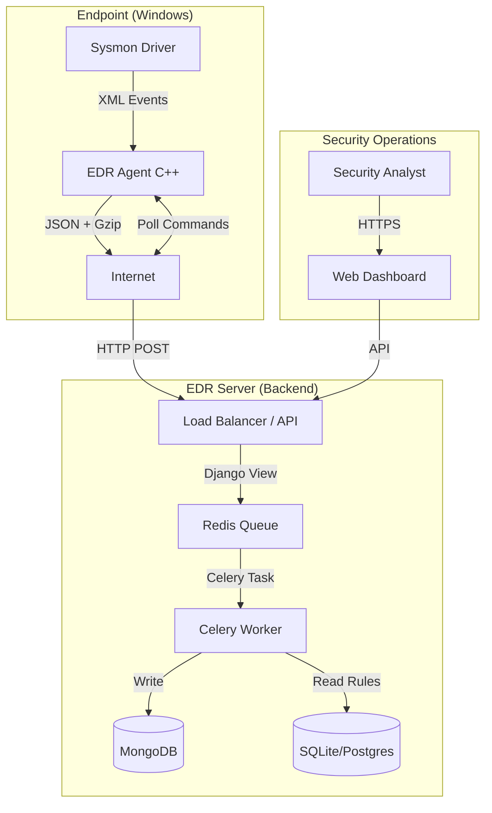

# Endpoint Detection and Response (EDR) System
## Official Documentation

---

# Part 1: Technical Reference Manual
**Target Audience:** System Architects, DevOps Engineers, Security Operations Center (SOC) Engineers, and Developers.

## 1.1 System Overview

The **Endpoint Detection and Response (EDR) System** is an enterprise-grade security platform designed to provide real-time visibility, threat detection, and incident response capabilities for Windows environments. It bridges the gap between passive monitoring and active defense.

### Core Capabilities
1.  **Telemetry Collection**: Captures granular system events (Process, Network, File) using the Windows Event Log API.
2.  **Threat Detection**: Evaluates events in real-time against a configurable rules engine (mapped to MITRE ATT&CK).
3.  **Incident Response**: Empowers analysts to remotely terminate malicious processes or isolate compromised hosts from the network.

### Architecture Diagram


---

## 1.2 Comprehensive Project Structure

Below is the complete file structure of the system with descriptions for every significant component.

### 📂 Root Directory
```text
Endpoint_detection_response-master/
├── backend/                  # Server-side application (Django)
│   ├── docker/               # Container orchestration
│   │   └── docker-compose.yml # Defines Redis and MongoDB services
│   ├── edr_server/           # Main Django project configuration
│   │   ├── settings.py       # Global config (Apps, DB, Middleware, Logging)
│   │   ├── urls.py           # Root URL routing
│   │   ├── middleware.py     # Custom DecompressMiddleware for Gzip support
│   │   └── wsgi.py           # WSGI entry point for production servers
│   ├── ingestion/            # Core application logic
│   │   ├── models.py         # MongoDB models (TelemetryEvent)
│   │   ├── models_mongo.py   # Command & Response models (PendingCommand)
│   │   ├── views.py          # Telemetry ingestion API endpoints
│   │   ├── tasks.py          # Celery background tasks (Async processing)
│   │   ├── rule_engine.py    # Detection logic & Rule evaluation
│   │   ├── serializers.py    # Data validation & Transformation
│   │   ├── command_views.py  # Agent command polling endpoints
│   │   ├── dashboard_views.py# UI views for the dashboard
│   │   └── urls.py           # App-specific URL routing
│   ├── health/               # Health check application
│   ├── testing/              # Automated test scripts
│   ├── manage.py             # Django CLI utility
│   └── requirements.txt      # Python dependencies
│
├── edr-agent/                # Client-side application (C++)
│   ├── build/                # Compilation output directory
│   ├── CMakeLists.txt        # CMake build configuration
│   ├── config.json           # Agent configuration (Server IP, Token)
│   ├── auth.secret           # Secure token storage (Git-ignored)
│   ├── EdrAgent.cpp          # Main entry point & Event Loop
│   ├── HttpClient.cpp/hpp    # WinHTTP wrapper for API communication
│   ├── CommandProcessor.cpp/hpp # Remote command execution logic
│   ├── EventConverter.cpp/hpp # Sysmon XML to JSON converter
│   ├── SimpleGzip.cpp/hpp    # Custom Deflate compression implementation
│   ├── miniz.c/h             # Minimal zlib-compatible compression library
│   ├── sysmon-config.xml     # Sysmon configuration file
│   └── uninstall_service.ps1 # Helper script for removal
```

---

## 1.3 Architectural Deep Dive

### 1.3.1 The Agent (C++)
The agent is designed for **minimal performance impact** and **maximum reliability**.
-   **Event Loop**: Uses `EvtSubscribe` to listen for Windows Events asynchronously. It does not poll the disk, reducing I/O.
-   **Compression**: Implements a custom Gzip stream using `miniz`. This reduces network bandwidth by approximately 90% for text-heavy JSON logs.
-   **Resilience**: The `HttpClient` includes auto-retry logic for network interruptions. If the server is unreachable, the agent continues monitoring (currently drops events if buffer full, extensible to disk buffer).

### 1.3.2 The Backend (Django + Celery)
The backend is designed for **high throughput** and **horizontal scalability**.
-   **Ingestion Layer**: The `telemetry_endpoint` is lightweight. It validates the token, pushes the payload to Redis, and responds immediately (201 Created). This ensures the agent never blocks waiting for the server.
-   **Processing Layer**: Celery workers pick up tasks from Redis. They perform CPU-intensive operations (JSON parsing, Rule Matching) and I/O-intensive operations (MongoDB writes) off the main request thread.
-   **Middleware**: `DecompressMiddleware` transparently handles Gzip-compressed bodies, allowing the views to work with standard JSON data without knowing about the compression.

### 1.3.3 The Rule Engine
The heart of the detection capability.
-   **Logic**: `rule_engine.py` implements a flexible evaluator supporting complex conditions (AND/OR, Regex, Substring).
-   **Caching**: `RuleCache` loads active rules into memory to avoid querying the database for every single event, ensuring sub-millisecond evaluation times.
-   **Evidence**: When a rule triggers, an `Alert` object is created with a snapshot of the relevant evidence (e.g., the specific command line that triggered the alert).

---

## 1.4 Deployment & Installation

### Server Deployment (Docker)
1.  **Prerequisites**: Docker Engine, Docker Compose.
2.  **Start Services**:
    ```bash
    cd backend/docker
    docker-compose up -d
    ```
    This starts Redis (Port 6379) and MongoDB (Port 27017).
3.  **Start Application**:
    ```bash
    cd backend
    pip install -r requirements.txt
    python manage.py migrate
    python manage.py runserver 0.0.0.0:8000
    ```
4.  **Start Worker**:
    ```bash
    celery -A edr_server worker --pool=gevent --concurrency=10 --loglevel=info
    ```

### Agent Deployment (Windows)
1.  **Prerequisites**: Sysmon installed with `sysmon -i sysmon-config.xml`.
2.  **Configuration**:
    -   Place `edr-agent.exe`, `config.json`, and `auth.secret` in `C:\Program Files\EDR-Agent\`.
    -   Ensure `config.json` points to your server IP.
3.  **Service Installation**:
    -   Use `sc create` or the provided PowerShell script to register the executable as a Windows Service for auto-start on boot.

---

# Part 2: User Manual
**Target Audience**: Security Analysts, IT Administrators.

## 2.1 Introduction
The **EDR Dashboard** is your command center for network security. It provides a unified view of all endpoints, alerts, and system health.

## 2.2 Dashboard Features

### 📊 Main Overview
-   **Status Cards**: Instantly see how many agents are online and how many unresolved alerts require attention.
-   **Event Volume**: A time-series graph showing the flow of telemetry data, helping you spot anomalies (e.g., a sudden spike in network connections).

### 🚨 Alert Management
The **Alerts Page** lists all detected threats.
-   **Severity Levels**:
    -   🔴 **Critical**: Immediate action required (e.g., Ransomware behavior).
    -   🟠 **High**: Serious threat (e.g., Credential dumping).
    -   🟡 **Medium**: Suspicious activity (e.g., Unusual PowerShell usage).
    -   🔵 **Low**: Informational or policy violation.
-   **Investigation**: Click any alert to see the full context:
    -   **Who**: User account involved.
    -   **What**: Process name and command line arguments.
    -   **Where**: Hostname and IP address.
    -   **When**: Exact timestamp of the event.

### 🛡️ Response Actions
Take control of compromised endpoints directly from the dashboard.

#### **1. Kill Process**
Stops a running program immediately.
-   **Use Case**: You see `malware.exe` running with PID 1234.
-   **Action**: Select "Kill Process", enter `1234`, and execute. The agent will terminate the process tree.

#### **2. Isolate Host**
Quarantines the computer from the network.
-   **Use Case**: A computer is infected with a worm spreading to other machines.
-   **Action**: Select "Isolate Host".
-   **Effect**: The agent modifies the Windows Firewall to **block all traffic** except:
    -   Connection to the EDR Server (so you can still manage it).
    -   DNS (to resolve the EDR server address).
-   **Recovery**: Once cleaned, use **"De-isolate Host"** to restore normal network access.

## 2.3 Troubleshooting Guide

| Issue | Probable Cause | Solution |
| :--- | :--- | :--- |
| **Agent Offline** | Service stopped or network blocked. | Check `services.msc` on endpoint. Verify firewall allows port 8000. |
| **No Alerts** | Sysmon not running. | Run `sc query sysmon64`. Re-install Sysmon configuration. |
| **Action Failed** | Agent offline or PID changed. | Refresh dashboard to check agent status. Verify PID is still active. |
| **401 Error** | Invalid Token. | Regenerate token in Admin Panel and update `auth.secret` on agent. |

## 2.4 Glossary

-   **Telemetry**: Raw data collected from endpoints (logs).
-   **IOC (Indicator of Compromise)**: Evidence of a breach (e.g., a specific file hash).
-   **False Positive**: A benign event incorrectly flagged as malicious.
-   **Lateral Movement**: An attacker moving from one compromised host to another.
-   **C2 (Command & Control)**: Communication between malware and the attacker's server.
Endpoint Detection and Response (EDR) System
Official Documentation
Part 1: Technical Reference Manual
Target Audience: System Architects, DevOps Engineers, Security Operations Center (SOC) Engineers, and Developers.

1.1 System Overview
The Endpoint Detection and Response (EDR) System is an enterprise-grade security platform designed to provide real-time visibility, threat detection, and incident response capabilities for Windows environments. It bridges the gap between passive monitoring and active defense.

Core Capabilities
Telemetry Collection: Captures granular system events (Process, Network, File) using the Windows Event Log API.
Threat Detection: Evaluates events in real-time against a configurable rules engine (mapped to MITRE ATT&CK).
Incident Response: Empowers analysts to remotely terminate malicious processes or isolate compromised hosts from the network.
Architecture Diagram
graph TD
    subgraph "Endpoint (Windows)"
        Sysmon[Sysmon Driver] -->|XML Events| Agent[EDR Agent C++]
        Agent -->|JSON + Gzip| Internet
        Agent <-->|Poll Commands| Internet
    end

    subgraph "EDR Server (Backend)"
        Internet -->|HTTP POST| LB[Load Balancer / API]
        LB -->|Django View| Redis[Redis Queue]
        Redis -->|Celery Task| Worker[Celery Worker]
        Worker -->|Write| Mongo[(MongoDB)]
        Worker -->|Read Rules| SQLite[(SQLite/Postgres)]
    end

    subgraph "Security Operations"
        Analyst[Security Analyst] -->|HTTPS| Dashboard[Web Dashboard]
        Dashboard -->|API| LB
    end
1.2 Comprehensive Project Structure
Below is the complete file structure of the system with descriptions for every significant component.

📂 Root Directory
Endpoint_detection_response-master/
├── backend/                  # Server-side application (Django)
│   ├── docker/               # Container orchestration
│   │   └── docker-compose.yml # Defines Redis and MongoDB services
│   ├── edr_server/           # Main Django project configuration
│   │   ├── settings.py       # Global config (Apps, DB, Middleware, Logging)
│   │   ├── urls.py           # Root URL routing
│   │   ├── middleware.py     # Custom DecompressMiddleware for Gzip support
│   │   └── wsgi.py           # WSGI entry point for production servers
│   ├── ingestion/            # Core application logic
│   │   ├── models.py         # MongoDB models (TelemetryEvent)
│   │   ├── models_mongo.py   # Command & Response models (PendingCommand)
│   │   ├── views.py          # Telemetry ingestion API endpoints
│   │   ├── tasks.py          # Celery background tasks (Async processing)
│   │   ├── rule_engine.py    # Detection logic & Rule evaluation
│   │   ├── serializers.py    # Data validation & Transformation
│   │   ├── command_views.py  # Agent command polling endpoints
│   │   ├── dashboard_views.py# UI views for the dashboard
│   │   └── urls.py           # App-specific URL routing
│   ├── health/               # Health check application
│   ├── testing/              # Automated test scripts
│   ├── manage.py             # Django CLI utility
│   └── requirements.txt      # Python dependencies
│
├── edr-agent/                # Client-side application (C++)
│   ├── build/                # Compilation output directory
│   ├── CMakeLists.txt        # CMake build configuration
│   ├── config.json           # Agent configuration (Server IP, Token)
│   ├── auth.secret           # Secure token storage (Git-ignored)
│   ├── EdrAgent.cpp          # Main entry point & Event Loop
│   ├── HttpClient.cpp/hpp    # WinHTTP wrapper for API communication
│   ├── CommandProcessor.cpp/hpp # Remote command execution logic
│   ├── EventConverter.cpp/hpp # Sysmon XML to JSON converter
│   ├── SimpleGzip.cpp/hpp    # Custom Deflate compression implementation
│   ├── miniz.c/h             # Minimal zlib-compatible compression library
│   ├── sysmon-config.xml     # Sysmon configuration file
│   └── uninstall_service.ps1 # Helper script for removal
1.3 Architectural Deep Dive
1.3.1 The Agent (C++)
The agent is designed for minimal performance impact and maximum reliability.

Event Loop: Uses EvtSubscribe to listen for Windows Events asynchronously. It does not poll the disk, reducing I/O.
Compression: Implements a custom Gzip stream using miniz. This reduces network bandwidth by approximately 90% for text-heavy JSON logs.
Resilience: The HttpClient includes auto-retry logic for network interruptions. If the server is unreachable, the agent continues monitoring (currently drops events if buffer full, extensible to disk buffer).
1.3.2 The Backend (Django + Celery)
The backend is designed for high throughput and horizontal scalability.

Ingestion Layer: The telemetry_endpoint is lightweight. It validates the token, pushes the payload to Redis, and responds immediately (201 Created). This ensures the agent never blocks waiting for the server.
Processing Layer: Celery workers pick up tasks from Redis. They perform CPU-intensive operations (JSON parsing, Rule Matching) and I/O-intensive operations (MongoDB writes) off the main request thread.
Middleware: DecompressMiddleware transparently handles Gzip-compressed bodies, allowing the views to work with standard JSON data without knowing about the compression.
1.3.3 The Rule Engine
The heart of the detection capability.

Logic: rule_engine.py implements a flexible evaluator supporting complex conditions (AND/OR, Regex, Substring).
Caching: RuleCache loads active rules into memory to avoid querying the database for every single event, ensuring sub-millisecond evaluation times.
Evidence: When a rule triggers, an Alert object is created with a snapshot of the relevant evidence (e.g., the specific command line that triggered the alert).
1.4 Deployment & Installation
Server Deployment (Docker)
Prerequisites: Docker Engine, Docker Compose.
Start Services:
cd backend/docker
docker-compose up -d
This starts Redis (Port 6379) and MongoDB (Port 27017).
Start Application:
cd backend
pip install -r requirements.txt
python manage.py migrate
python manage.py runserver 0.0.0.0:8000
Start Worker:
celery -A edr_server worker --pool=gevent --concurrency=10 --loglevel=info
Agent Deployment (Windows)
Prerequisites: Sysmon installed with sysmon -i sysmon-config.xml.
Configuration:
Place edr-agent.exe, config.json, and auth.secret in C:\Program Files\EDR-Agent\.
Ensure config.json points to your server IP.
Service Installation:
Use sc create or the provided PowerShell script to register the executable as a Windows Service for auto-start on boot.
Part 2: User Manual
Target Audience: Security Analysts, IT Administrators.

2.1 Introduction
The EDR Dashboard is your command center for network security. It provides a unified view of all endpoints, alerts, and system health.

2.2 Dashboard Features
📊 Main Overview
Status Cards: Instantly see how many agents are online and how many unresolved alerts require attention.
Event Volume: A time-series graph showing the flow of telemetry data, helping you spot anomalies (e.g., a sudden spike in network connections).
🚨 Alert Management
The Alerts Page lists all detected threats.

Severity Levels:
🔴 Critical: Immediate action required (e.g., Ransomware behavior).
🟠 High: Serious threat (e.g., Credential dumping).
🟡 Medium: Suspicious activity (e.g., Unusual PowerShell usage).
🔵 Low: Informational or policy violation.
Investigation: Click any alert to see the full context:
Who: User account involved.
What: Process name and command line arguments.
Where: Hostname and IP address.
When: Exact timestamp of the event.
🛡️ Response Actions
Take control of compromised endpoints directly from the dashboard.

1. Kill Process
Stops a running program immediately.

Use Case: You see malware.exe running with PID 1234.
Action: Select "Kill Process", enter 1234, and execute. The agent will terminate the process tree.
2. Isolate Host
Quarantines the computer from the network.

Use Case: A computer is infected with a worm spreading to other machines.
Action: Select "Isolate Host".
Effect: The agent modifies the Windows Firewall to block all traffic except:
Connection to the EDR Server (so you can still manage it).
DNS (to resolve the EDR server address).
Recovery: Once cleaned, use "De-isolate Host" to restore normal network access.
2.3 Troubleshooting Guide
Issue	Probable Cause	Solution
Agent Offline	Service stopped or network blocked.	Check services.msc on endpoint. Verify firewall allows port 8000.
No Alerts	Sysmon not running.	Run sc query sysmon64. Re-install Sysmon configuration.
Action Failed	Agent offline or PID changed.	Refresh dashboard to check agent status. Verify PID is still active.
401 Error	Invalid Token.	Regenerate token in Admin Panel and update auth.secret on agent.
2.4 Glossary
Telemetry: Raw data collected from endpoints (logs).
IOC (Indicator of Compromise): Evidence of a breach (e.g., a specific file hash).
False Positive: A benign event incorrectly flagged as malicious.
Lateral Movement: An attacker moving from one compromised host to another.
C2 (Command & Control): Communication between malware and the attacker's server.